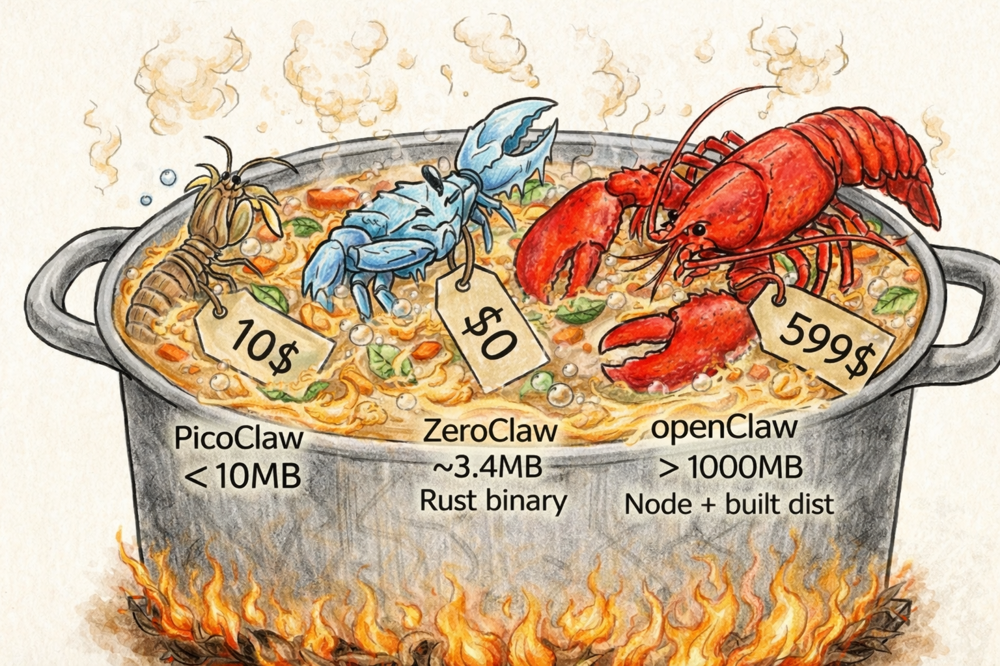

# Alternativas a OpenClaw: de gigantes a microagentes

*Última actualización: abril 2026*

**Traducciones:** [English](README.md) · [中文](README.zh-CN.md) · [Español](README.es.md) · [日本語](README.ja.md) · [Deutsch](README.de.md) · [Русский](README.ru.md)



---

En este resumen exploramos los proyectos actuales: desde el buque insignia OpenClaw hasta soluciones extremadamente ligeras como NullClaw que arrancan más rápido de lo que parpadeas.

## 🧭 ¿Qué elegir? Navegador rápido

Si necesitas ponerte en marcha rápido, esto es lo que buscamos:

| Objetivo | Proyecto recomendado | ¿Por qué? |
|----------|---------------------|------------|
| **Elección universal** | [**Nanobot**](https://github.com/HKUDS/nanobot) | Punto medio: Python, comunidad activa, soporte multi-instancia, poco exigente con el hardware (RAM 300MB+) |
| **Máxima potencia** | [**OpenClaw**](https://github.com/openclaw/openclaw) | El estándar, y con eso basta. 15+ canales de comunicación, voz, soporte Canvas, RAM 2GB+ |
| **Auto-mejora / investigación** | [**Hermes Agent**](https://github.com/NousResearch/hermes-agent) | Nous Research: bucle de aprendizaje, skills y memoria, MCP, gateway; migración desde OpenClaw (`hermes claw migrate`) |
| **Para máquinas débiles** | [**ZeroClaw**](https://github.com/zeroclaw-labs/zeroclaw) | Motor Rust, consume solo ~5MB RAM |
| **IoT y Edge** | [**PicoClaw**](https://github.com/sipeed/picoclaw) | Funciona en hardware de $10 (ESP32 y similares) |
| **Seguridad** | [**IronClaw**](https://github.com/nearai/ironclaw) | Sandbox WebAssembly y enfoque paranoico con la privacidad |
| **Go / escala** | [**GoClaw**](https://github.com/nextlevelbuilder/goclaw) | OpenClaw en Go: multi-tenant, seguridad en 5 capas, concurrencia nativa |
| **Minimalismo** | [**TinyClaw**](https://github.com/jlia0/tinyclaw) | Solo 400 líneas de código. Ideal para aprender |

## 📊 Tabla comparativa

Ordenado por popularidad y actividad en GitHub (datos de abril 2026).

| Proyecto | ⭐ Stars | Lenguaje | Tipo | Características |
|----------|---------|----------|------|-----------------|
| [**OpenClaw**](https://github.com/openclaw/openclaw) | 357k | TypeScript | Agente IA | Proyecto base, soporte MCP y AWS EC2 |
| [**Hermes Agent**](https://github.com/NousResearch/hermes-agent) | 86k | Python | Agente IA | Aprendizaje, skills, gateway, migración OpenClaw |
| [**Nanobot**](https://github.com/HKUDS/nanobot) | 39k | Python | Agente IA | Multi-instancia, ultra ligero |
| [**ZeroClaw**](https://github.com/zeroclaw-labs/zeroclaw) | 30k | Rust | Agente IA | Uso de memoria ~5MB, arranque rápido |
| [**AstrBot**](https://github.com/AstrBotDevs/AstrBot) | 29k | Python | Chatbot | Enfocado en plataformas IM (TG, WhatsApp) |
| [**PicoClaw**](https://github.com/sipeed/picoclaw) | 28k | Go | Edge/IoT | Funciona como nodo en gateway, hardware barato |
| [**NanoClaw**](https://github.com/qwibitai/nanoclaw) | 27k | TypeScript | Agente IA | Containerización, enfoque en mensajería empresarial |
| [**IronClaw**](https://github.com/nearai/ironclaw) | 11.8k | Rust | Agente IA | Sandbox WASM, máximo aislamiento |
| [**GoClaw**](https://github.com/nextlevelbuilder/goclaw) | 2.7k | Go | Agente IA | Multi-tenant, seguridad en 5 capas, MCP, Postgres |

*Estrellas aproximadas; valores exactos: [scripts/data/github_stats.json](scripts/data/github_stats.json). Insignias en vivo: [shields.io](https://shields.io/badges/git-hub-repo-stars) (`https://img.shields.io/github/stars/<owner>/<repo>`).*

## 🛠 Alternativas de nicho y «micro-langostas»

Para quienes buscan soluciones específicas — desde bare-metal hasta sistemas Erlang.

### Rendimiento y Edge

- [**NullClaw**](https://github.com/nullclaw/nullclaw) (Zig): Rendimiento fantástico. Binario 678KB, arranque <2ms. Adecuado para Arduino y RPi.
- [**MimiClaw**](https://github.com/memovai/mimiclaw) (C): Funciona en ESP32-S3 bare-metal. Coste de la solución ~$5.
- [**SubZeroClaw**](https://github.com/jmlago/subzeroclaw) (C): Solo 54KB.

### Seguridad y tolerancia a fallos

- [**ZeptoClaw**](https://github.com/qhkm/zeptoclaw): Sistema de seguridad de 7 capas en Rust.
- [**BeamClaw**](https://github.com/peterdmv/beamclaw): Escrito en Erlang/OTP para sistemas distribuidos.
- [**Safeclaw**](https://github.com/princezuda/safeclaw): Funciona sin LLM (reconocimiento de intención), garantizando 100% de predictibilidad.

## 🚀 Inicio rápido

Para quienes llevan tiempo queriendo probar — hemos recopilado los comandos para lanzar las ramas más populares. Tiempo de configuración: hasta 3 minutos.

### 1. Nanobot (entrada más rápida)

```bash
git clone https://github.com/HKUDS/nanobot.git && cd nanobot
docker compose run --rm nanobot-cli onboard
# Añade tu API key en ~/.nanobot/config.json
docker compose up -d nanobot-gateway
```

### 2. ZeroClaw (configuración mínima)

```bash
git clone https://github.com/zeroclaw-labs/zeroclaw.git && cd zeroclaw
cp .env.example .env   # configurar API_KEY
docker compose up -d
```

### 3. PicoClaw

```bash
git clone https://github.com/sipeed/picoclaw.git && cd picoclaw
docker compose -f docker/docker-compose.yml --profile gateway up   # primera ejecución
vim docker/data/config.json   # API keys, tokens de bots
docker compose -f docker/docker-compose.yml --profile gateway up -d
```

### 4. OpenClaw

```bash
git clone https://github.com/openclaw/openclaw.git && cd openclaw
./docker-setup.sh   # asistente, construcción de imagen, primera ejecución
```

## Recursos útiles

- **Skills / Recursos:** [clawhub](https://github.com/clawhub) / [awesome-openclaw-skills](https://github.com/VoltAgent/awesome-openclaw-skills)
- **Más repositorios:** tema de GitHub [`openclaw-alternative`](https://github.com/topics/openclaw-alternative)

---

## 💡 Sugiere otros proyectos

**¿Nos hemos dejado alguno? ¡Dínoslo!** Abre un [Issue](https://github.com/skynes/openclaw-alternatives/issues) o envía un Pull Request — lo compararemos y lo añadiremos al resumen.
